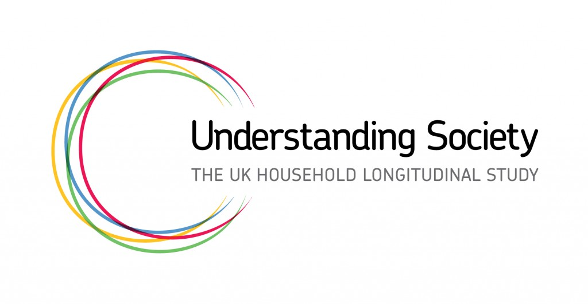
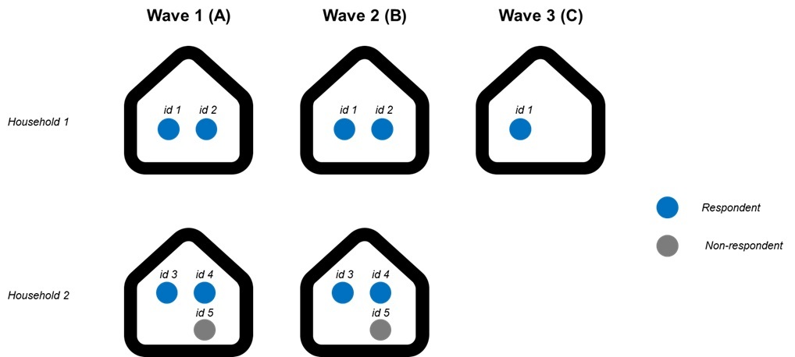

# Working with Understanding Society

#### Project Status: In progress

## Project Description

**Understanding Society**, the UK Household Longitudinal Study (UKHLS), is one of the largest panel survey in the world, supporting social and economic research. Its sample size is 40,000 households from the United Kingdom or approximately 100,000 individuals. The survey includes all household members (excluding those who opt out or are unable to respond) and interviews them year after year (see Figure below).

The survey covers a wide variety of topics, and its structure means you can source information on respondents, those they live with and apply panel data methods such as fixed effects regressions. These models are popular in social sciences, because they allow to adjust for individual variation and adjust for some types of omitted variable bias.

The code in this repository allows you to process and transform the raw survey files, so you can get started with your analysis using the entire range of data collected in the survey.

## Data source

* The raw survey data can be download from the UK Data Service. The version we use is hosted [here](https://beta.ukdataservice.ac.uk/datacatalogue/studies/study?id=6614).

## How does it work?

We will be using the following files, for each wave. 

* **indresp**: containing survey responses (this is the largest file).
* **indall**: this file also contains select variables on non-respondents (for example, the age of those who opt out from the survey). It also includes respondents, so we need to deduplicate records that appear several times.
* **hhresp**: contaning household-specific variable, such as household size or household income.
* **egoalt**: this file includes the relationships between survey respondents (e.g. person 1 is the partner of person 2).

Each wave has a letter associated with it, starting with 'a' for wave 1 and so on. Each file comes with this letter as a prefix so, for example, 'a_indresp' is the file containing individual responses for wave 1.

This repository includes two main files:

* **'0. Append USoc files.R'** This is the file that reads in all your desired indresp, indall, hhresp and egoalt files and transforms them so we end up with a clean, long-format file 'USOC long.csv' at the end. It can take some time to run (~20 minutes) because the input files are large.

* **1. Create variables.R** This file starts with 'USOC long.csv' and creates some basic variables that will be useful for analysis, such as age, economic status and caring status.

If you would like to add any variables to this pipeline, please refer to the [questionnaire modules](https://www.understandingsociety.ac.uk/documentation/mainstage/dataset-documentation/questionnaire-modules) hosted online to find any other survey questions you might be interested in. 

### Requirements

These scripts were written in R version 4.0.2. You will need to install the following R packages as well:

* tidyverse
* haven
* data.table
* splitstackshape

### Getting started

Describe the way in which the code can be used. 

## Useful references

Don't forget to use **survey weights** when working with this dataset, otherwise it won't be nationally representative. Here is a [useful guide](https://www.understandingsociety.ac.uk/documentation/mainstage/user-guides/main-survey-user-guide/selecting-the-correct-weight-for-your-analysis) from the data owners.

## Authors

* Sebastien Peytrignet - [Twitter](https://twitter.com/SebastienPeytr2) - [GitHub](https://github.com/sg-peytrignet)

## License

This project is licensed under the MIT License.

## Acknowledgments

I would like to thank Dr. David Bartram, University of Leicester, who wrote the original R Script to process Understanding Society, which formed the basis for our own scripts.
